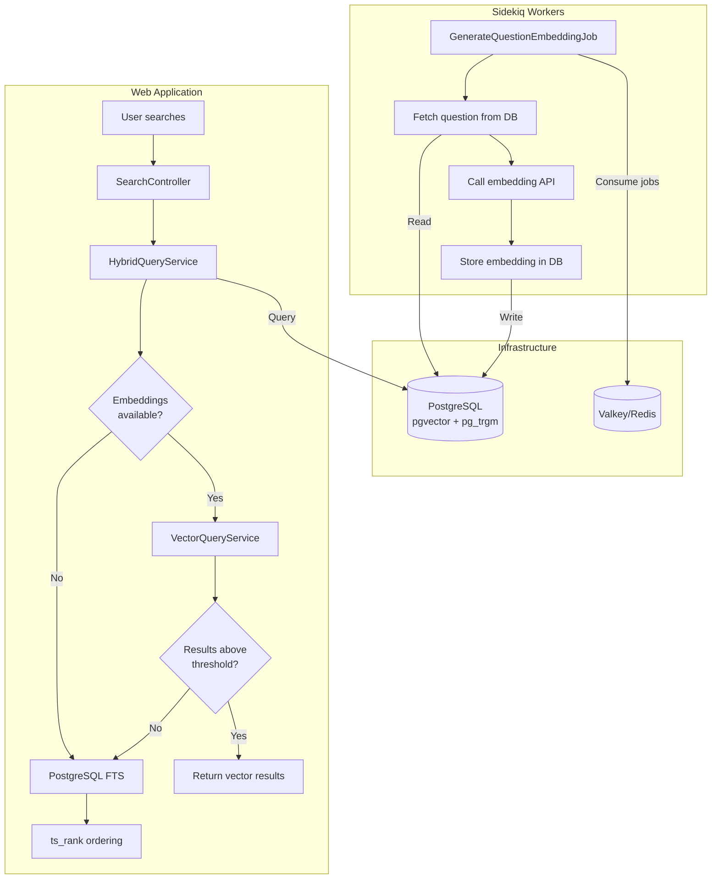

# CLAUDE.md

This file provides guidance to Claude Code (claude.ai/code) when working with code in this repository.

## Project: Brimming

A Stack Overflow-style Q&A platform built with Ruby on Rails.

**Developed by [Tight Line LLC](https://www.tightlinesoftware.com)**

Open-source project hosted on GitHub under the MIT License.

---

## Session Plan File (CRITICAL)

**You MUST maintain a session plan file at `.claude/session-plan.md` for every non-trivial task.**

### Why
Context compaction or conversation failures can cause loss of progress. The plan file serves as persistent memory that survives these failures, allowing work to resume without starting over.

### When to Create/Update
1. **After planning**: Write the full detailed plan before starting implementation
2. **After each round of edits**: Update to reflect what was completed and what remains
3. **Before any complex operation**: Ensure the file is current

### What to Include
- **Task Summary**: What the user asked for
- **Current Status**: What phase of work we're in
- **Completed Steps**: What has been done, with file paths and brief descriptions
- **Remaining Steps**: What still needs to be done
- **Key Decisions**: Any important choices made and why
- **Test Status**: Whether tests pass, coverage status

### Format Example
```markdown
# Session Plan: [Brief Task Description]

## Task Summary
[What the user requested]

## Status: [Planning | In Progress | Testing | Complete]

## Completed
- [x] Step 1 description (files: path/to/file.rb)
- [x] Step 2 description

## Remaining
- [ ] Step 3 description
- [ ] Step 4 description

## Key Decisions
- Decision 1: [rationale]

## Notes
[Any other context needed to resume]
```

**NEVER skip updating this file. It is your memory across context boundaries.**

---

### Core Concepts
- **Questions** belong to **Spaces** and are posted by **Users**
- **Answers** belong to Questions and are posted by Users
- **Articles** belong to Spaces - long-form content that can be commented on (but not answered)
- Users **vote** on Questions, Answers, and Comments (up/down for Q&A, upvote-only for comments)
- Answers are displayed sorted by vote score (highest first)
- Space **moderators** can mark one Answer as **"Solved"** for a Question
- **Best Answer** = highest-voted answer for a question (may differ from Solved)
- **Karma** system rewards participation: +5 questions, +10 answers, +15 solved, +1 per upvote
- **Bookmarks** allow users to save Questions, Answers, Comments, and Articles for later
- User identity is their RFC 5322 email address; they choose a display username and optional avatar

### Tech Stack
- Ruby 3.4.7
- Ruby on Rails 8.1
- PostgreSQL 17 with pgvector and pg_trgm (primary database + vector embeddings + full-text search)
- Valkey 9.0 (Redis-compatible, for caching and Sidekiq)
- Sidekiq (background jobs)
- Docker Compose (local development)
- Helm 3.x (Kubernetes deployment)
- RSpec (test framework - 100% coverage required)
- GitHub Actions (CI/CD)

### Architecture
```
docker-compose.dev.yml (local dev)
├── app (Rails web server)
├── dev (Rails development container for shell/console)
├── worker (Sidekiq background jobs)
├── postgres (with pgvector + pg_trgm + firecrawl schema)
├── valkey (db0: Rails/Sidekiq, db1: Firecrawl)
├── openldap (test LDAP server)
├── phpldapadmin (LDAP admin UI)
├── mailhog (email testing)
└── firecrawl (self-hosted web scraper, optional)

docker-compose.yml (production-like)
├── app (Rails: Web UI + API + MCP server)
├── worker (Sidekiq)
├── postgres (with pgvector + pg_trgm)
└── valkey

helm/brimming/ (Kubernetes)
├── app (Deployment + Service)
├── worker (Deployment)
├── postgres (StatefulSet or external, with pgvector + pg_trgm)
└── valkey (StatefulSet or external)
```

### Authentication
- Local auth via Devise
- SSO via modular OmniAuth strategy:
  - **LDAP/ActiveDirectory**: Multiple servers supported, admin-configurable
  - **Social**: Google, Facebook, LinkedIn, GitHub, GitLab (admin-toggleable)

### LDAP Group-to-Space Mapping
- Admins can configure multiple LDAP servers
- Each LDAP server can have group-to-space mappings:
  - Map LDAP group names (fully-qualified DN or partial match) to one or more Spaces
  - Auto-registration into mapped Spaces happens at login time
- Users can opt-out of auto-registered Spaces
- System persists opt-out choices via `SpaceOptOut` model
- On subsequent logins, opted-out Spaces are skipped even if LDAP group still matches

### Authorization Roles
- **User**: Post questions, post answers, vote
- **Moderator** (per-space): Mark correct answers, moderate content
- **Admin**: Manage spaces, assign moderators, configure SSO, manage LDAP mappings

### Reader Providers (Web Page Import)

Articles can be imported from web URLs using configurable reader providers. The system fetches clean markdown from web pages for indexing and display.

**Supported Providers:**
- **Jina.ai Reader** (`jina`) - Cloud service, API key optional, good for public internet pages
- **Firecrawl** (`firecrawl`) - Self-hosted, good for internal/firewalled pages

**Configuration:**
- Admin UI at `/admin/reader_providers`
- Multiple providers can be configured; users select which to use when importing
- Articles store `source_url` and `reader_provider_id` for refresh capability

**Jina.ai:**
- Works without any local infrastructure
- Free tier available, API key optional
- Default endpoint: `https://r.jina.ai`

**Firecrawl (Self-hosted):**
```bash
# Start Firecrawl (uses existing Postgres and Valkey)
docker-compose -f docker-compose.dev.yml up -d firecrawl

# Default endpoint: http://firecrawl:3002
# API key for self-hosted: fc-dev (or any value - TEST_API_KEY disables auth)
```

Firecrawl shares our Postgres (schema in `docker/postgres/firecrawl_init.sql`) and Valkey (database 1). The schema is auto-initialized on fresh Postgres volumes, or run manually:
```bash
docker-compose -f docker-compose.dev.yml exec -T postgres psql -U brimming \
  -f /docker-entrypoint-initdb.d/02-firecrawl.sql
```

Note: Image is amd64-only, runs via emulation on Apple Silicon.

### Search Architecture

Brimming uses **hybrid search** with a **vector-first, keyword-fallback** strategy:

1. If embeddings are available and configured, use **pgvector semantic search**
2. If semantic search returns no results above the similarity threshold, fall back to **PostgreSQL full-text search**



**Key Components:**

| Component | Purpose | Location |
|-----------|---------|----------|
| `Search::HybridQueryService` | Vector-first with keyword fallback | `app/services/search/hybrid_query_service.rb` |
| `Search::VectorQueryService` | pgvector semantic search | `app/services/search/vector_query_service.rb` |
| `Search::SuggestionsService` | Autocomplete via pg_trgm | `app/services/search/suggestions_service.rb` |
| `EmbeddingService` | Embedding generation with adapter pattern | `app/services/embedding_service.rb` |
| `GenerateQuestionEmbeddingJob` | Background embedding generation | `app/jobs/generate_question_embedding_job.rb` |

**PostgreSQL Full-Text Search:**
- `search_vector` tsvector column on questions table
- Weighted search: A=title (highest), B=body, C=answer content
- Auto-updated via PostgreSQL trigger on question changes
- Answer changes trigger `refresh_search_vector!` via callback
- GIN index for fast searching

**Per-Model Similarity Thresholds:**
Different embedding models have different score distributions. Thresholds are tuned per-model:
- OpenAI text-embedding-3-small: 0.28
- Ollama embeddinggemma: 0.38
- Ollama nomic-embed-text: 0.42
- See `EmbeddingProvider::DEFAULT_SIMILARITY_THRESHOLDS` for full list

**Embedding Providers:**
- Configured via Admin UI at `/admin/embedding_providers`
- Supports: OpenAI, Cohere, Ollama, Azure OpenAI, AWS Bedrock, HuggingFace
- API keys encrypted at rest using Active Record Encryption

---

## Development Commands

All commands use the Makefile for consistency. Run `make help` to see all available targets.

```bash
# Initial setup
make setup

# Start/stop services
make up
make down
make restart
make logs

# Development
make shell      # Open bash in dev container
make console    # Rails console
make server     # Start Rails server at localhost:33000

# Database
make db-create
make db-migrate
make db-rollback
make db-reset   # Drop, create, migrate, seed, and reindex
make db-seed

# Testing (100% coverage required)
make test           # Run all tests
make test-models    # Model specs only
make test-requests  # Request specs only
make test-jobs      # Job specs only

# IMPORTANT: When running rspec directly (not via make), you MUST set RAILS_ENV=test
# Example: docker-compose -f docker-compose.dev.yml exec -T dev env RAILS_ENV=test bundle exec rspec
# This is required because `allow_browser versions: :modern` is conditionally skipped
# in test environment, and without RAILS_ENV=test the class loads with browser checks enabled,
# causing 403 Forbidden responses in tests.

# Code quality
make lint       # RuboCop
make lint-fix   # RuboCop with auto-fix
make security   # Brakeman + bundler-audit

# Helm
make helm-lint
make helm-test

# Full CI pipeline
make ci
```

---

## Project Roadmap

For project phases, current status, and technical debt, see [PLAN.md](PLAN.md).

---

## Code Conventions

- Models in `app/models/`
- Request specs preferred over controller specs
- Service objects in `app/services/` for complex operations
- Pundit policies in `app/policies/`
- Background jobs in `app/jobs/`
- Use `frozen_string_literal: true` in all Ruby files
- Prefer `let` and `let!` in RSpec over instance variables

### Case Statements and Unreachable Code

**Never add `else` branches to case statements for impossible cases.** If a case cannot be reached based on the data model constraints (e.g., a polymorphic association that only allows specific types), do not add defensive `else` branches. This avoids:
1. Untestable code that hurts coverage metrics
2. The temptation to use `:nocov:` directives
3. Misleading code that suggests invalid states are possible

If requirements change and new cases become possible, add the `else` branch at that time with proper tests.

### Test Helpers for Configuration Values

**Never hardcode environment-specific values in tests.** Values like URLs or configuration strings should be derived from the same source the application uses (constants, Rails config, or test helpers).

### Definition of Done

Work is **not finished** until:
1. **Test coverage is 100%** (line and branch) - run `make test`
2. **Linting is clean** (no RuboCop offenses) - run `make lint`

Always verify both before considering any task complete.

---

## Helm Chart Guidelines

- Chart lives in `helm/brimming/`
- Use helm-unittest for chart tests (in `helm/brimming/tests/`)
- **Every new workload requires**:
  1. Template in `templates/`
  2. Values in `values.yaml`
  3. Test in `tests/`
- CI runs: `helm lint`, `helm template | kubeval`, `helm unittest`
- Support both bundled (subchart) and external modes for:
  - PostgreSQL (with pgvector + pg_trgm extensions)
  - Valkey

---

## Repository Structure

```
/
├── .github/
│   ├── workflows/
│   │   └── ci.yml            # CI pipeline (lint, test, security, helm, build)
│   ├── ISSUE_TEMPLATE/
│   └── PULL_REQUEST_TEMPLATE.md
├── helm/
│   └── brimming/
│       ├── Chart.yaml
│       ├── values.yaml
│       ├── templates/
│       └── tests/
├── app/
│   ├── models/concerns/      # Model mixins
│   │   └── searchable.rb     # Auto-indexing callbacks for search
│   ├── policies/             # Pundit authorization policies
│   ├── services/search/      # Search integration
│   ├── services/embedding_service.rb
│   ├── services/embedding_service/
│   │   ├── client.rb
│   │   └── adapters/         # Provider adapters (OpenAI, Cohere, Ollama, etc.)
│   ├── jobs/
│   └── ...
├── spec/
│   ├── factories/
│   ├── models/
│   ├── policies/
│   ├── requests/
│   ├── jobs/
│   └── support/
├── CLAUDE.md                  # This file (AI assistant context)
├── PLAN.md                    # Project roadmap and phases
├── README.md
├── Makefile
├── docker-compose.yml
├── docker-compose.dev.yml
├── Dockerfile
└── Dockerfile.dev
```
