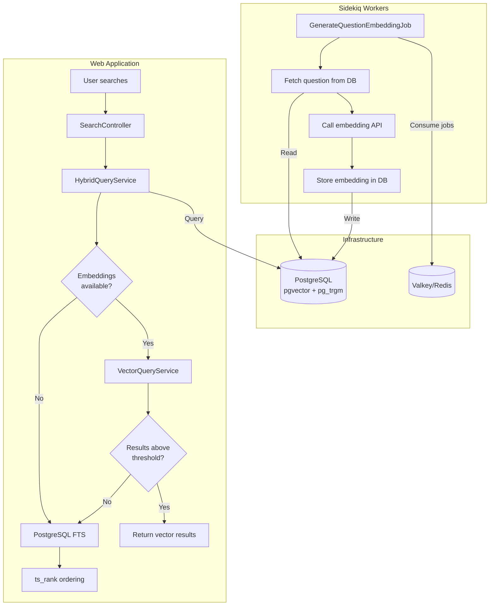

# CLAUDE.md

This file provides guidance to Claude Code (claude.ai/code) when working with code in this repository.

## Project: Brimming

A Stack Overflow-style Q&A platform built with Ruby on Rails.

**Developed by [Tight Line LLC](https://www.tightlinesoftware.com)**

Open-source project hosted on GitHub under the MIT License.

---

## Session Plan File (CRITICAL)

**You MUST maintain a session plan file at `.claude/session-plan.md` for every non-trivial task.**

### Why
Context compaction or conversation failures can cause loss of progress. The plan file serves as persistent memory that survives these failures, allowing work to resume without starting over.

### When to Create/Update
1. **After planning**: Write the full detailed plan before starting implementation
2. **After each round of edits**: Update to reflect what was completed and what remains
3. **Before any complex operation**: Ensure the file is current

### What to Include
- **Task Summary**: What the user asked for
- **Current Status**: What phase of work we're in
- **Completed Steps**: What has been done, with file paths and brief descriptions
- **Remaining Steps**: What still needs to be done
- **Key Decisions**: Any important choices made and why
- **Test Status**: Whether tests pass, coverage status

### Format Example
```markdown
# Session Plan: [Brief Task Description]

## Task Summary
[What the user requested]

## Status: [Planning | In Progress | Testing | Complete]

## Completed
- [x] Step 1 description (files: path/to/file.rb)
- [x] Step 2 description

## Remaining
- [ ] Step 3 description
- [ ] Step 4 description

## Key Decisions
- Decision 1: [rationale]

## Notes
[Any other context needed to resume]
```

**NEVER skip updating this file. It is your memory across context boundaries.**

---

### Core Concepts
- **Questions** belong to **Spaces** and are posted by **Users**
- **Answers** belong to Questions and are posted by Users
- **Articles** belong to Spaces - long-form content that can be commented on (but not answered)
- Users **vote** on Questions, Answers, and Comments (up/down for Q&A, upvote-only for comments)
- Answers are displayed sorted by vote score (highest first)
- Space **moderators** can mark one Answer as **"Solved"** for a Question
- **Best Answer** = highest-voted answer for a question (may differ from Solved)
- **Karma** system rewards participation: +5 questions, +10 answers, +15 solved, +1 per upvote
- **Bookmarks** allow users to save Questions, Answers, Comments, and Articles for later
- User identity is their RFC 5322 email address; they choose a display username and optional avatar

### Tech Stack
- Ruby 3.4.7
- Ruby on Rails 8.1
- PostgreSQL 17 with pgvector and pg_trgm (primary database + vector embeddings + full-text search)
- Valkey 9.0 (Redis-compatible, for caching and Sidekiq)
- Sidekiq (background jobs)
- Docker Compose (local development)
- Helm 3.x (Kubernetes deployment)
- RSpec (test framework - 100% coverage required)
- GitHub Actions (CI/CD)

### Architecture
```
docker-compose.dev.yml (local dev)
├── app (Rails web server)
├── dev (Rails development container for shell/console)
├── worker (Sidekiq background jobs)
├── postgres (with pgvector + pg_trgm)
├── valkey
├── openldap (test LDAP server)
├── phpldapadmin (LDAP admin UI)
└── mailhog (email testing)

docker-compose.yml (production-like)
├── app (Rails: Web UI + API + MCP server)
├── worker (Sidekiq)
├── postgres (with pgvector + pg_trgm)
└── valkey

helm/brimming/ (Kubernetes)
├── app (Deployment + Service)
├── worker (Deployment)
├── postgres (StatefulSet or external, with pgvector + pg_trgm)
└── valkey (StatefulSet or external)
```

### Authentication
- Local auth via Devise
- SSO via modular OmniAuth strategy:
  - **LDAP/ActiveDirectory**: Multiple servers supported, admin-configurable
  - **Social**: Google, Facebook, LinkedIn, GitHub, GitLab (admin-toggleable)

### LDAP Group-to-Space Mapping
- Admins can configure multiple LDAP servers
- Each LDAP server can have group-to-space mappings:
  - Map LDAP group names (fully-qualified DN or partial match) to one or more Spaces
  - Auto-registration into mapped Spaces happens at login time
- Users can opt-out of auto-registered Spaces
- System persists opt-out choices via `SpaceOptOut` model
- On subsequent logins, opted-out Spaces are skipped even if LDAP group still matches

### Authorization Roles
- **User**: Post questions, post answers, vote
- **Moderator** (per-space): Mark correct answers, moderate content
- **Admin**: Manage spaces, assign moderators, configure SSO, manage LDAP mappings

### Search Architecture

Brimming uses **hybrid search** with a **vector-first, keyword-fallback** strategy:

1. If embeddings are available and configured, use **pgvector semantic search**
2. If semantic search returns no results above the similarity threshold, fall back to **PostgreSQL full-text search**



**Key Components:**

| Component | Purpose | Location |
|-----------|---------|----------|
| `Search::HybridQueryService` | Vector-first with keyword fallback | `app/services/search/hybrid_query_service.rb` |
| `Search::VectorQueryService` | pgvector semantic search | `app/services/search/vector_query_service.rb` |
| `Search::SuggestionsService` | Autocomplete via pg_trgm | `app/services/search/suggestions_service.rb` |
| `EmbeddingService` | Embedding generation with adapter pattern | `app/services/embedding_service.rb` |
| `GenerateQuestionEmbeddingJob` | Background embedding generation | `app/jobs/generate_question_embedding_job.rb` |

**PostgreSQL Full-Text Search:**
- `search_vector` tsvector column on questions table
- Weighted search: A=title (highest), B=body, C=answer content
- Auto-updated via PostgreSQL trigger on question changes
- Answer changes trigger `refresh_search_vector!` via callback
- GIN index for fast searching

**Per-Model Similarity Thresholds:**
Different embedding models have different score distributions. Thresholds are tuned per-model:
- OpenAI text-embedding-3-small: 0.28
- Ollama embeddinggemma: 0.38
- Ollama nomic-embed-text: 0.42
- See `EmbeddingProvider::DEFAULT_SIMILARITY_THRESHOLDS` for full list

**Embedding Providers:**
- Configured via Admin UI at `/admin/embedding_providers`
- Supports: OpenAI, Cohere, Ollama, Azure OpenAI, AWS Bedrock, HuggingFace
- API keys encrypted at rest using Active Record Encryption

---

## Development Commands

All commands use the Makefile for consistency. Run `make help` to see all available targets.

```bash
# Initial setup
make setup

# Start/stop services
make up
make down
make restart
make logs

# Development
make shell      # Open bash in dev container
make console    # Rails console
make server     # Start Rails server at localhost:33000

# Database
make db-create
make db-migrate
make db-rollback
make db-reset   # Drop, create, migrate, seed, and reindex
make db-seed

# Testing (100% coverage required)
make test           # Run all tests
make test-models    # Model specs only
make test-requests  # Request specs only
make test-jobs      # Job specs only

# IMPORTANT: When running rspec directly (not via make), you MUST set RAILS_ENV=test
# Example: docker-compose -f docker-compose.dev.yml exec -T dev env RAILS_ENV=test bundle exec rspec
# This is required because `allow_browser versions: :modern` is conditionally skipped
# in test environment, and without RAILS_ENV=test the class loads with browser checks enabled,
# causing 403 Forbidden responses in tests.

# Code quality
make lint       # RuboCop
make lint-fix   # RuboCop with auto-fix
make security   # Brakeman + bundler-audit

# Helm
make helm-lint
make helm-test

# Full CI pipeline
make ci
```

---

## Project Phases

Track progress by updating status: `[ ]` pending, `[~]` in progress, `[x]` complete

### Phase 1: Project Setup `[x]`
- Rails 8.1 app with PostgreSQL 18.1
- Docker Compose dev environment (dev, postgres, valkey)
- RSpec + FactoryBot + Shoulda Matchers configured
- SimpleCov for coverage reporting (100% target)
- RuboCop configured
- GitHub Actions CI workflow
- README.md with badges (CI status, coverage)
- CONTRIBUTING.md, CODE_OF_CONDUCT.md, LICENSE (MIT)
- Makefile with standard targets

### Phase 2: Helm Chart Foundation `[ ]`
- Create `helm/brimming/` chart structure
- Chart.yaml with proper metadata
- values.yaml with sensible defaults
- Templates for initial workloads:
  - app Deployment + Service + Ingress
  - worker Deployment
  - ConfigMap for Rails config
  - Secret template for credentials
- PostgreSQL and Valkey as optional subcharts or external
- Helm chart tests using helm-unittest
- CI step to lint and test Helm chart
- **NOTE**: Update Helm chart tests whenever adding new workloads

### Phase 3: Core Data Models `[x]`
- User (email, username, full_name, avatar_url, role)
- Space (name, slug, description)
- Question (title, body, user_id, space_id, vote_score, views_count, edited_at)
- Answer (body, user_id, question_id, is_correct, vote_score, edited_at)
- Vote (user_id, answer_id, value: +1/-1)
- QuestionVote (user_id, question_id, value: +1/-1)
- Comment (body, user_id, commentable polymorphic, parent_id for nesting, vote_score, edited_at)
- CommentVote (user_id, comment_id)
- SpaceSubscription (user_id, space_id)
- SpaceModerator (user_id, space_id)
- Database migrations with proper indexes and constraints

### Phase 4: Authentication Foundation `[x]`
- Devise setup for User model `[x]`
- Registration (email + username + password) `[x]`
- Login/logout `[x]`
- Password reset (Devise recoverable) `[x]`
- Session management (Devise rememberable) `[x]`
- Basic authorization helper methods `[x]`

### Phase 5: Core Q&A Features `[x]`
- Questions: full CRUD (create, read, edit, delete own) `[x]`
- Answers: full CRUD (create, read, edit, delete own) `[x]`
- Comments: full CRUD with nested replies `[x]`
- Voting on questions (one vote per user per question) `[x]`
- Voting on answers (one vote per user per answer) `[x]`
- Voting on comments (upvote only) `[x]`
- Answer ordering by vote score `[x]`
- Question show page with answers `[x]`

### Phase 6: Spaces & Moderation `[x]`
- Space CRUD (admin only) `[x]`
- SpaceModerator join model `[x]`
- Pundit policies for authorization `[x]`
  - SpacePolicy: admin-only CRUD, moderators can manage moderator list
  - QuestionPolicy: owner edit/delete, moderator hard-delete
  - AnswerPolicy: owner edit/delete, moderator hard-delete
  - CommentPolicy: owner edit/delete, moderator hard-delete
- Moderator: mark answer as solved (is_correct) `[x]`
- Admin/Moderator: manage space moderators `[x]`
- Type-ahead user search for moderator management `[x]`

### Phase 7: Web UI & Navigation `[x]`
- Custom CSS styling (no framework) `[x]`
- Responsive layout with header navigation `[x]`
- Home page: recent questions with space filtering `[x]`
- Space browsing and filtering `[x]`
- User profile page with stats `[x]`
- Gamification: karma system, solved answers count, best answers count `[x]`
- User badge component showing karma, solved count, best answer count `[x]`

### Phase 8: SSO - LDAP/ActiveDirectory `[x]`
- OmniAuth LDAP strategy `[x]`
- LdapServer model (name, host, port, encryption, bind_dn, bind_password, user_search_base, group_search_base) `[x]`
- Support for multiple LDAP servers `[x]`
- Admin UI to add/edit/remove LDAP servers `[x]`
- LdapGroupMapping model (ldap_server_id, group_pattern, pattern_type: exact|prefix|suffix|contains) `[x]`
- LdapGroupMappingSpace join (ldap_group_mapping_id, space_id) `[x]`
- SpaceOptOut model (user_id, space_id, ldap_group_mapping_id) `[x]`
- Auto-registration service that runs at login: `[x]`
  1. Fetch user's LDAP groups
  2. Match against configured patterns
  3. Subscribe user to mapped Spaces (skip if opted-out)
- User UI to view and opt-out of LDAP-assigned Spaces `[x]`

### Phase 9: SSO - Social Providers `[ ]`
- OmniAuth strategies: Google, Facebook, LinkedIn, GitHub, GitLab
- SsoProvider model (provider, enabled, client_id, client_secret)
- Admin UI to enable/configure providers
- Account linking for existing users

### Phase 10: Search Integration `[x]`
- PostgreSQL full-text search with tsvector/tsquery `[x]`
- Weighted search vectors (A=title, B=body, C=answers) `[x]`
- pgvector extension for semantic search `[x]`
- Hybrid search: vector-first with keyword fallback `[x]`
- Per-model similarity thresholds for embeddings `[x]`
- Configurable embedding providers (OpenAI, Cohere, Ollama, etc.) `[x]`
- Search API endpoint with filters (space, tags, sort) `[x]`
- Search UI with autocomplete suggestions (pg_trgm) `[x]`
- Sidekiq worker container for background embedding generation `[x]`
- Sidekiq Web UI at `/admin/sidekiq` (admin-only) `[x]`
- Admin UI for embedding provider configuration `[x]`

### Phase 11: Background Workers & Email `[~]`
- Sidekiq configuration `[x]`
- Sidekiq Web UI (admin-only at `/admin/sidekiq`) `[x]`
- User email preferences (per-post, daily digest, weekly digest, none)
- SpaceSubscription model `[x]` (exists, used for space membership)
- DigestMailer
- Scheduled jobs for daily/weekly digests

### ~~Phase 2: Helm Chart Foundation~~ `[skipped]`
*Moved to Phase 17 - will implement after core features are complete.*

### ~~Phase 9: SSO - Social Providers~~ `[skipped]`
*Moved to Phase 18 - lower priority than other features.*

### Phase 12: Articles `[x]`
- **Article model** (title, body, user_id, slug, vote_score, views_count, edited_at, context) `[x]`
- **ArticleSpace join model** - Articles can belong to multiple Spaces `[x]`
- **ArticleVote model** - Upvote-only voting (no downvotes on articles) `[x]`
- Articles posted by publishers/moderators/admins (configurable per-space via SpacePublisher) `[x]`
- **Key differences from Questions:**
  - No answers - articles are one-way content `[x]`
  - Comments allowed (same nested comment system as Questions) `[x]`
  - Upvoting only (no downvotes) `[x]`
  - Views tracking `[x]`
  - Support for file uploads: PDF, DOCX, XLSX with content extraction `[x]`
  - Typically longer-form, authoritative content
- **Content types supported:**
  - Markdown (text body, rendered with markdown helper) `[x]`
  - HTML (text body or uploaded .html file) `[x]`
  - PDF (uploaded, displayed inline with iframe) `[x]`
  - Word Document (uploaded .docx, download only) `[x]`
  - Excel Spreadsheet (uploaded .xlsx, download only) `[x]`
  - Plain Text (text body) `[x]`
- **Content extraction service** for indexing binary files `[x]`
- **Search integration:**
  - Included in hybrid search results alongside Questions `[x]`
  - Chunked for better retrieval precision `[x]`
  - Embedded using configured embedding provider `[x]`
- **RAG integration:**
  - Articles included in embedding generation and retrieval `[x]`
  - Useful as authoritative source material for AI-generated answers
- **Article CRUD** `[x]`
- **ArticlePolicy** for authorization (publishers/moderators/admins can create/edit) `[x]`
- **Skipped:** Draft/published workflow (not implemented)

### Phase 13: Bookmarks `[x]`
- **Bookmark model** (user_id, bookmarkable_type, bookmarkable_id, created_at, notes) `[x]`
  - Polymorphic association to Question, Answer, Comment, Article `[x]`
- Users can bookmark any content for later reference `[x]`
- **UI features:** `[x]`
  - Bookmark button on Questions, Answers, Comments, Articles `[x]`
  - "My Bookmarks" page with filtering by type `[x]`
  - Optional notes field for personal annotations `[x]`
  - Sort by date bookmarked or content date `[x]`
- **Turbo Stream updates** for instant bookmark/unbookmark feedback `[x]`
- **BookmarkPolicy** - users can only manage their own bookmarks `[x]`

### Phase 14: Chunking & RAG Queries `[x]`
- **Content chunking** for long-form content (Articles, long Questions/Answers)
  - Break content into overlapping chunks for better retrieval precision `[x]`
  - Chunk model (chunkable_type, chunkable_id, chunk_index, content, embedding) `[x]`
  - Configurable chunk size and overlap (via EmbeddingProvider) `[x]`
  - ChunkingService with sentence-boundary-aware splitting `[x]`
- **Improved embedding strategy:**
  - Embed chunks instead of (or in addition to) full documents `[x]`
  - Store chunk embeddings in pgvector `[x]`
  - Retrieval returns relevant chunks with source context `[x]`
  - ChunkVectorQueryService for semantic chunk search `[x]`
- **RAG query pipeline:**
  - Query → embedding → chunk retrieval → context assembly → response `[x]`
  - Configurable number of chunks to retrieve `[x]`
  - Re-ranking options (cross-encoder, reciprocal rank fusion) `[skipped]` *(optional/future - current retrieval quality is sufficient)*
- **Citation support:**
  - Track which chunks contributed to a response `[x]`
  - Link citations back to source content (Article, Question) `[x]`
  - Inline citations `[1]`, `[2]` in AI Answer and Q&A Wizard `[x]`
  - AnswerSource model persists citations on published FAQ answers `[x]`
  - Database lookup fallback for slug resolution when LLM returns unmatched source IDs `[x]`
- **Admin configuration:**
  - Chunk size, overlap, max chunks per query (via EmbeddingProvider + SearchSetting) `[x]`
  - Per-space override for RAG chunk limit `[x]`
- **Prompt engineering:**
  - RAG and fallback prompts in `config/prompts/` `[x]`
  - Markdown formatting rules to ensure proper list rendering `[x]`

### Phase 15: Q&A Wizard `[~]`
- **Admin/moderator tool to populate spaces with pre-approved FAQ content**
- **Use cases:**
  - Bootstrap new spaces with authoritative Q&A before users arrive
  - Get ahead of common questions before they're asked (possibly poorly) by users
  - Convert long-form documentation (Articles) into searchable, bite-sized Q&A
- **Wizard workflow:** `[x]`
  1. Admin/moderator selects a space and optionally source material (Articles, external docs)
  2. System uses AI to analyze content and suggest question/answer pairs
  3. Moderator reviews, edits, and approves suggested Q&A
  4. Approved Q&A posted as real questions with answers pre-marked as "Solved"
- **Content sources:** `[x]`
  - Generate from Articles in the space (extract FAQs from documentation) `[x]`
  - Generate from topic description (free-form text) `[x]`
  - Generate from knowledge base (RAG-enhanced retrieval) `[x]`
  - Generate from uploaded documents (PDF, Markdown, text) `[ ]`
  - Import from external FAQ sources `[ ]`
- **AI integration:** `[x]`
  - Uses configured LLM provider to generate suggestions `[x]`
  - RAG-enhanced: pulls relevant context from existing space content `[x]`
  - Generates natural-sounding questions users might actually ask `[x]`
- **Metadata:** `[~]`
  - Questions/Answers posted by "Helpful Robot" system user `[x]`
  - Human sponsor tracked via `sponsored_by` field `[x]`
  - Track source material (which Article/document spawned this Q&A) `[ ]`
  - Special styling/badge for official FAQ content in UI `[ ]`

### Phase 16: REST API & Swagger `[ ]`
- API namespace with versioning (api/v1)
- Token authentication (Devise tokens or JWT)
- Full CRUD endpoints for all resources
- API documentation via Swagger/OpenAPI (Rswag gem)
- Interactive API explorer at `/api/docs`

### Phase 17: MCP Server `[ ]`
- MCP protocol integration - Brimming as a **knowledge base backend for AI assistants**
- **Primary tools:**
  - `retrieve(query, space_slugs[]?, limit?)` - **Retrieval only** (primitive RAG)
    - Uses hybrid search (vector + keyword) to find relevant content
    - Returns ranked chunks/blocks (questions, answers, comments) with context and similarity scores
    - AI agent incorporates these into its own generation workflow
    - Most flexible - agent controls synthesis, can combine with other sources
  - `ask(question, space_slugs[]?)` - **Full RAG** (retrieval + generation)
    - Retrieves relevant content, then synthesizes an answer using configured LLM
    - Returns generated response with citations/sources from the knowledge base
    - Simpler integration - Brimming handles the full RAG pipeline
- **Supporting tools:**
  - `list_spaces()` - List available knowledge domains with descriptions
- **Configuration:**
  - Admin-configurable LLM provider for `ask` synthesis (OpenAI, Anthropic, Ollama, etc.)
  - Configurable context window size, max sources, similarity threshold
  - Rate limiting per client
- **Authentication:** API token or OAuth for MCP clients
- **Update Helm chart** if MCP requires separate service/port
- **Update Helm tests** if architecture changes

### Phase 18: Helm Chart Foundation `[ ]`
- Create `helm/brimming/` chart structure
- Chart.yaml with proper metadata
- values.yaml with sensible defaults
- Templates for initial workloads:
  - app Deployment + Service + Ingress
  - worker Deployment
  - ConfigMap for Rails config
  - Secret template for credentials
- PostgreSQL and Valkey as optional subcharts or external
- Helm chart tests using helm-unittest
- CI step to lint and test Helm chart
- **NOTE**: Update Helm chart tests whenever adding new workloads

### Phase 19: SSO - Social Providers `[ ]`
- OmniAuth strategies: Google, Facebook, LinkedIn, GitHub, GitLab
- SsoProvider model (provider, enabled, client_id, client_secret)
- Admin UI to enable/configure providers
- Account linking for existing users

---

## Current Status

**Completed Phases**: 1, 3, 4, 5, 6, 7, 8, 10, 12, 13, 14
**In Progress**: 11 (Email digests), 15 (Q&A Wizard - minor enhancements pending)
**Not Started**: 16, 17, 18, 19

### What's Working
- Full data model with Users, Spaces, Questions, Answers, Comments, Votes
- Devise authentication with registration (username + email + password), login/logout
- **Multi-email support** with verification emails, primary email switching, login with any verified email
- **User profile settings** page with display name, avatar upload (Active Storage), timezone selection
- **Hamburger menu** for user settings navigation (Profile, Subscriptions, Bookmarks, LDAP Spaces)
- Full web UI for browsing and creating questions, answers, and comments
- Voting system for questions, answers, and comments (with Turbo Stream updates)
- Nested comments with replies (up to 3 levels deep)
- Karma system with gamification (questions, answers, solved, best answers, votes)
- User badges showing karma, solved answer count, best answer count
- Space subscriptions and moderator assignments
- "Solved" designation for moderator-approved answers
- "Best" designation for highest-voted answers per question
- Sign-in modal for unauthenticated users attempting protected actions
- **Pundit authorization** for all resources (Questions, Answers, Comments, Spaces, Articles)
- **Moderator management UI** with type-ahead user search (admins and space moderators)
- **LDAP/ActiveDirectory SSO** with multiple server support
- **LDAP group-to-space mapping** with auto-registration at login
- **User opt-out UI** for LDAP-assigned spaces
- **Hybrid search** combining PostgreSQL full-text search + pgvector semantic search
- **Vector-first, keyword-fallback** search strategy
- **Automatic search vector updates** via PostgreSQL triggers
- **Embedding generation** for questions and articles via configurable providers
- **Content chunking** for articles with automatic embedding generation
- **Admin-configurable embedding providers** (OpenAI, Cohere, Ollama, etc.) with encrypted API keys
- **Admin-configurable LLM providers** (OpenAI, Anthropic, Ollama, Azure OpenAI, Bedrock, Cohere) for AI features
- **Sidekiq Web UI** at `/admin/sidekiq` (admin-only)
- Tags for questions (per-space, up to 5 per question)
- **Articles** with multiple content types (Markdown, HTML, PDF, DOCX, XLSX)
- **Q&A Wizard** for moderators to generate FAQ content from articles, topics, or knowledge base
- **"Helpful Robot"** system user for AI-generated content with human sponsorship tracking
- **Bookmarks** for users to save Questions, Answers, Comments, and Articles for later
- **AI Answer** with inline citations `[1]`, `[2]` linking to source articles/questions
- **AnswerSource model** for persisting citations on FAQ answers
- **Prompt engineering** with markdown formatting rules for proper list rendering in AI-generated content
- 100% test coverage (line and branch)

### Next Actions
1. **Phase 11 (Email)**: Add email digests and notifications

### Technical Debt

#### PostgreSQL Client / pg_dump / Migrations Mess

**Status:** Needs cleanup

**Problem:** We have a fragile, inconsistent setup for PostgreSQL tooling across different environments:

1. **CI (GitHub Actions):** Uses `psql` to load `structure.sql` directly, bypassing Rails migrations entirely to avoid `pg_dump` version mismatch (runner has pg_dump 16, container runs PG 17)

2. **Docker production image:** Uses Debian's default postgresql-client (v15) because the PGDG repo's PG17 client has broken dependencies (`libldap-2.5-0` not available in bookworm-slim)

3. **structure.sql post-processing:** `lib/tasks/db_structure_fix.rake` patches `structure.sql` after every migration to:
   - Add `IF NOT EXISTS` to schema/extension statements
   - Re-add `CREATE EXTENSION` for vector/pg_trgm if pg_dump omits them
   - This runs automatically after `db:migrate` and `db:schema:dump`

4. **Extension schema:** Extensions live in `public` schema (not `brimming`) for portability, but types must be qualified as `public.vector` in structure.sql because pg_dump clears the search_path

**Risks:**
- CI doesn't actually test migrations, only schema loading
- Version mismatches between environments could cause subtle bugs
- The rake task is a band-aid that may break with future Rails/PG versions

**Ideal Solution:**
- Pin all environments to the same PostgreSQL major version
- Use a Docker image with matching pg_dump version in CI
- Or: switch to `schema.rb` format (loses some PG-specific features)
- Or: use a proper multi-stage CI that runs migrations in a container

---

## Code Conventions

- Models in `app/models/`
- Request specs preferred over controller specs
- Service objects in `app/services/` for complex operations
- Pundit policies in `app/policies/`
- Background jobs in `app/jobs/`
- Use `frozen_string_literal: true` in all Ruby files
- Prefer `let` and `let!` in RSpec over instance variables

### Case Statements and Unreachable Code

**Never add `else` branches to case statements for impossible cases.** If a case cannot be reached based on the data model constraints (e.g., a polymorphic association that only allows specific types), do not add defensive `else` branches. This avoids:
1. Untestable code that hurts coverage metrics
2. The temptation to use `:nocov:` directives
3. Misleading code that suggests invalid states are possible

If requirements change and new cases become possible, add the `else` branch at that time with proper tests.

### Test Helpers for Configuration Values

**Never hardcode environment-specific values in tests.** Values like URLs or configuration strings should be derived from the same source the application uses (constants, Rails config, or test helpers).

### Definition of Done

Work is **not finished** until:
1. **Test coverage is 100%** (line and branch) - run `make test`
2. **Linting is clean** (no RuboCop offenses) - run `make lint`

Always verify both before considering any task complete.

---

## Helm Chart Guidelines

- Chart lives in `helm/brimming/`
- Use helm-unittest for chart tests (in `helm/brimming/tests/`)
- **Every new workload requires**:
  1. Template in `templates/`
  2. Values in `values.yaml`
  3. Test in `tests/`
- CI runs: `helm lint`, `helm template | kubeval`, `helm unittest`
- Support both bundled (subchart) and external modes for:
  - PostgreSQL (with pgvector + pg_trgm extensions)
  - Valkey

---

## Repository Structure

```
/
├── .github/
│   ├── workflows/
│   │   └── ci.yml            # CI pipeline (lint, test, security, helm, build)
│   ├── ISSUE_TEMPLATE/
│   └── PULL_REQUEST_TEMPLATE.md
├── helm/
│   └── brimming/
│       ├── Chart.yaml
│       ├── values.yaml
│       ├── templates/
│       └── tests/
├── app/
│   ├── models/concerns/      # Model mixins
│   │   └── searchable.rb     # Auto-indexing callbacks for search
│   ├── policies/             # Pundit authorization policies
│   │   ├── application_policy.rb
│   │   ├── space_policy.rb
│   │   ├── question_policy.rb
│   │   ├── answer_policy.rb
│   │   └── comment_policy.rb
│   ├── services/search/      # Search integration
│   │   ├── hybrid_query_service.rb  # Vector-first with keyword fallback
│   │   ├── vector_query_service.rb  # pgvector semantic search
│   │   └── suggestions_service.rb   # Autocomplete via pg_trgm
│   ├── services/embedding_service.rb        # Embedding generation module
│   ├── services/embedding_service/
│   │   ├── client.rb         # Embedding client with provider selection
│   │   └── adapters/         # Provider adapters (OpenAI, Cohere, Ollama, etc.)
│   ├── jobs/
│   │   ├── generate_question_embedding_job.rb  # Single question embedding
│   │   └── regenerate_all_embeddings_job.rb    # Batch embedding regeneration
│   └── ...
├── spec/
│   ├── factories/            # FactoryBot factories
│   ├── models/
│   ├── policies/             # Policy specs
│   ├── requests/
│   ├── jobs/
│   └── support/
├── CLAUDE.md                  # This file (AI assistant context)
├── .cursorrules               # Cursor AI context (points to CLAUDE.md)
├── .clinerules                # Cline AI context (points to CLAUDE.md)
├── README.md                  # Project intro, badges, setup
├── CONTRIBUTING.md            # Contribution guidelines
├── CODE_OF_CONDUCT.md         # Community standards
├── LICENSE                    # MIT License
├── Makefile                   # All development commands
├── docker-compose.yml         # Production-like local environment
├── docker-compose.dev.yml     # Development environment
├── Dockerfile                 # Production image
├── Dockerfile.dev             # Development image
└── ... (Rails app structure)
```
