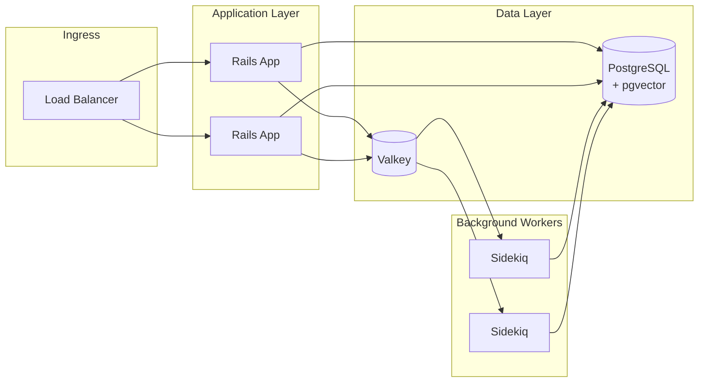

# Brimming

[](https://github.com/Tight-Line/brimming/actions/workflows/ci.yml)
[](coverage/)
[](LICENSE)

A Stack Overflow-style Q&A platform built with Ruby on Rails.

**Developed by [Tight Line LLC](https://www.tightlinesoftware.com)**

## Features

### Core Q&A
- **Questions & Answers** - Users post questions in Spaces, others provide answers
- **Voting System** - Community votes on questions/answers, sorted by score
- **Moderation** - Space moderators can mark answers as "Solved"
- **Comments** - Nested comment threads (up to 3 levels) on questions and answers
- **Tags** - Per-space tagging for questions (up to 5 per question)

### Knowledge Base
- **Articles** - Long-form authoritative content for documentation and guides
- **Multiple Content Types** - Markdown, HTML, PDF, Word, Excel, and web page imports
- **Web Page Import** - Fetch content from URLs via Jina.ai or self-hosted Firecrawl
- **Content Extraction** - Automatic text extraction from uploaded files for search indexing

### Search & AI
- **Hybrid Search** - PostgreSQL full-text search with pgvector semantic fallback
- **RAG Integration** - Content chunking with embeddings for retrieval-augmented generation
- **Q&A Wizard** - AI-powered FAQ generation from articles and knowledge base
- **Configurable Providers** - Support for OpenAI, Cohere, Ollama, and other embedding/LLM providers

### User Experience
- **User Profiles** - Karma system with stats for questions, answers, and best answers
- **Bookmarks** - Save questions, answers, comments, and articles for later
- **SSO Support** - LDAP/ActiveDirectory with group-to-space mapping

### Coming Soon
- **Email Digests** - Configurable per-post, daily, or weekly notifications
- **REST API** - Full API for programmatic access
- **MCP Server** - AI assistant integration via Model Context Protocol
- **Social SSO** - Google, GitHub, LinkedIn, and more

## Tech Stack

- **Backend**: Ruby on Rails 8.1, PostgreSQL 17 (with pgvector + pg_trgm)
- **Background Jobs**: Sidekiq with Valkey 9.0
- **Search**: PostgreSQL full-text search + pgvector for semantic search
- **Deployment**: Docker, Helm 3.x for Kubernetes

## Quick Start

### Prerequisites

- Docker and Docker Compose
- Make

### Setup

```bash
# Clone the repository
git clone https://github.com/Tight-Line/brimming.git
cd brimming

# Set up the development environment
make setup

# Start all services
make up

# Access the application at http://localhost:33000
```

## Development

All development commands use the Makefile for consistency:

| Command | Description |
|---------|-------------|
| `make setup` | Initial project setup |
| `make up` | Start all services |
| `make down` | Stop all services |
| `make restart` | Restart all services |
| `make logs` | Tail service logs |
| `make shell` | Open bash shell in dev container |
| `make console` | Open Rails console |
| `make server` | Start Rails server |

### Database

| Command | Description |
|---------|-------------|
| `make db-create` | Create databases |
| `make db-migrate` | Run pending migrations |
| `make db-rollback` | Rollback last migration |
| `make db-reset` | Drop, create, migrate, and seed |
| `make db-seed` | Load seed data |

### Testing

We require 100% test coverage for all code.

| Command | Description |
|---------|-------------|
| `make test` | Run all tests with coverage |
| `make test-models` | Run model specs |
| `make test-requests` | Run request specs |
| `make test-jobs` | Run job specs |
| `make coverage` | Generate coverage report |

### Code Quality

| Command | Description |
|---------|-------------|
| `make lint` | Run RuboCop linter |
| `make lint-fix` | Auto-fix lint issues |
| `make security` | Run security scans |

### Helm (Coming Soon)

| Command | Description |
|---------|-------------|
| `make helm-lint` | Lint Helm chart |
| `make helm-test` | Run Helm chart tests |

### CI Pipeline

```bash
make ci  # Run full CI pipeline (lint, security, test, helm)
```

## Deployment

### Docker Compose (Production-like)

```bash
docker-compose up -d
```

### Kubernetes (Helm) - Coming Soon

```bash
helm install brimming helm/brimming \
  -f values.yaml \
  -n brimming \
  --create-namespace
```

## Configuration

### Environment Variables

| Variable | Description | Default |
|----------|-------------|---------|
| `DB_HOST` | PostgreSQL host | `postgres` |
| `DB_PORT` | PostgreSQL port | `5432` |
| `DB_USER` | Database user | `brimming` |
| `DB_PASS` | Database password | - |
| `DB_NAME` | Database name | `brimming` |
| `REDIS_URL` | Valkey/Redis URL | `redis://valkey:6379/0` |
| `SECRET_KEY_BASE` | Rails secret key | - |
| `SMTP_HOST` | SMTP server hostname | - |
| `SMTP_PORT` | SMTP server port | `587` |
| `SMTP_TLS` | Enable TLS (`true`/`false`) | - |
| `SMTP_USER` | SMTP username (optional) | - |
| `SMTP_PASS` | SMTP password (optional) | - |
| `SMTP_AUTH` | SMTP auth method | `plain` |
| `MAILER_FROM` | Default sender email | `noreply@brimming.local` |

### Database Schema

All application tables are created in the `brimming` schema (not `public`). This is a best practice for separating app tables from PostgreSQL system objects.

- **Database name**: `brimming` in all environments except test (`brimming_test`)
- **Schema**: `brimming` (search_path: `brimming,public`)
- **Console access**: `make db-console` opens psql with correct search_path

### Development Services

All development services run via Docker Compose with non-standard ports to avoid conflicts:

| Service | URL | Credentials |
|---------|-----|-------------|
| **Web Application** | http://localhost:33000 | See "Test Accounts" below |
| **Mailhog** (email viewer) | http://localhost:33025 | No login required |
| **phpLDAPadmin** | http://localhost:38080 | See "LDAP" below |
| **PostgreSQL** | localhost:35432 | `brimming` / `brimming_dev` |
| **Valkey (Redis)** | localhost:36379 | No auth |
| **OpenLDAP** | localhost:30389 | See "LDAP" below |

#### Test Accounts

After running `make db-seed`, these accounts are available:

| Email | Password | Role |
|-------|----------|------|
| admin@example.com | password123 | Admin |
| sarah.chen@example.com | password123 | User (moderator) |
| *(all seed users)* | password123 | Various |

#### LDAP Test Users

Login via "Sign in with LDAP" using **username** (not email):

| Username | Password | Name | Groups |
|----------|----------|------|--------|
| jsmith | password123 | John Smith | engineering, managers |
| mjones | password123 | Mary Jones | engineering, design |
| bwilson | password123 | Bob Wilson | engineering, devops |
| agarcia | password123 | Ana Garcia | design, managers |
| dlee | password123 | David Lee | devops |

#### phpLDAPadmin

To browse/edit LDAP data at http://localhost:38080:
- **Login DN**: `cn=admin,dc=brimming,dc=local`
- **Password**: `admin_secret`

#### Email (Mailhog)

Development uses [Mailhog](https://github.com/mailhog/MailHog) to capture all outgoing emails without actually sending them. Visit http://localhost:33025 to view captured emails (no login required).

#### Database Console

```bash
make db-console  # Opens psql with correct schema
```

Direct connection: `psql -h localhost -p 35432 -U brimming -d brimming`

### SSO Configuration

LDAP servers and group-to-space mappings are configured through the admin panel at `/admin/ldap_servers`. Social SSO providers (coming soon) will be configurable at `/admin/sso_providers`.

## Architecture



## Contributing

See [CONTRIBUTING.md](CONTRIBUTING.md) for guidelines.

## Code of Conduct

See [CODE_OF_CONDUCT.md](CODE_OF_CONDUCT.md).

## License

This project is licensed under the MIT License - see [LICENSE](LICENSE) for details.

Copyright (c) 2025 [Tight Line LLC](https://www.tightlinesoftware.com)
