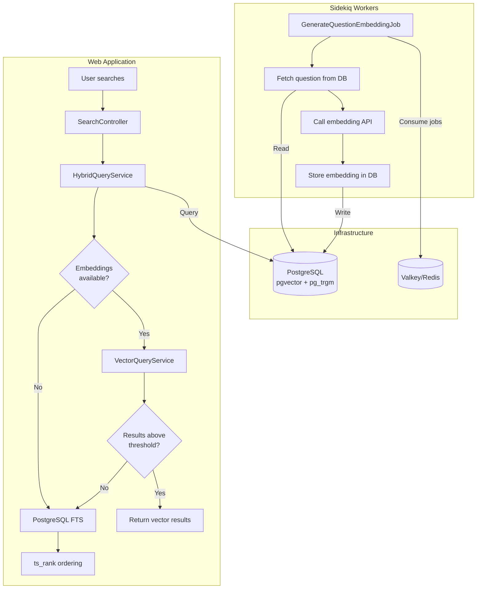

# Search Architecture

Brimming uses **hybrid search** with a **vector-first, keyword-fallback** strategy:

1. If embeddings are available and configured, use **pgvector semantic search**
2. If semantic search returns no results above the similarity threshold, fall back to **PostgreSQL full-text search**

## Flow

## Key Components

| Component | Purpose | Location |
|-----------|---------|----------|
| `Search::HybridQueryService` | Vector-first with keyword fallback | `app/services/search/hybrid_query_service.rb` |
| `Search::VectorQueryService` | pgvector semantic search | `app/services/search/vector_query_service.rb` |
| `Search::SuggestionsService` | Autocomplete via pg_trgm | `app/services/search/suggestions_service.rb` |
| `EmbeddingService` | Embedding generation with adapter pattern | `app/services/embedding_service.rb` |

## PostgreSQL Full-Text Search

- `search_vector` tsvector column on questions table
- Weighted search: A=title (highest), B=body, C=answer content
- Auto-updated via PostgreSQL trigger on question changes
- GIN index for fast searching

## Embedding Providers

Configured via Admin UI at `/admin/embedding_providers`. Supports: OpenAI, Cohere, Ollama, Azure OpenAI, AWS Bedrock, HuggingFace.

**Per-Model Similarity Thresholds** (tuned per model):
- OpenAI text-embedding-3-small: 0.28
- Ollama nomic-embed-text: 0.42
- See `EmbeddingProvider::DEFAULT_SIMILARITY_THRESHOLDS` for full list
